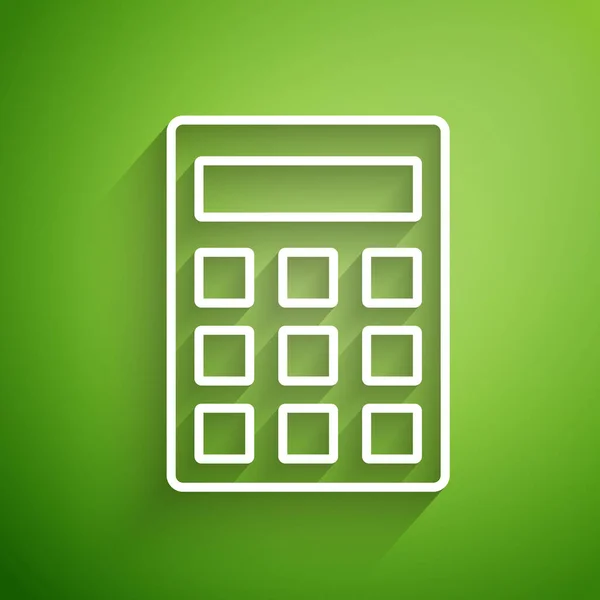
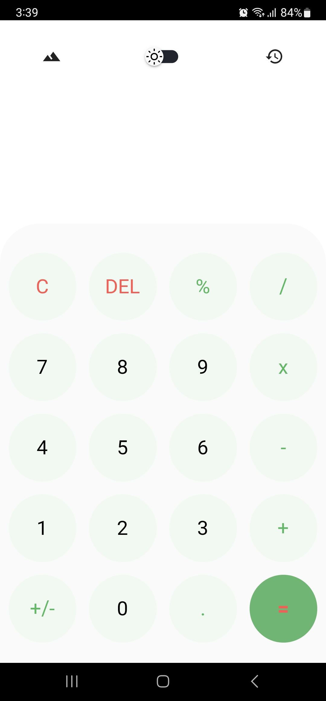
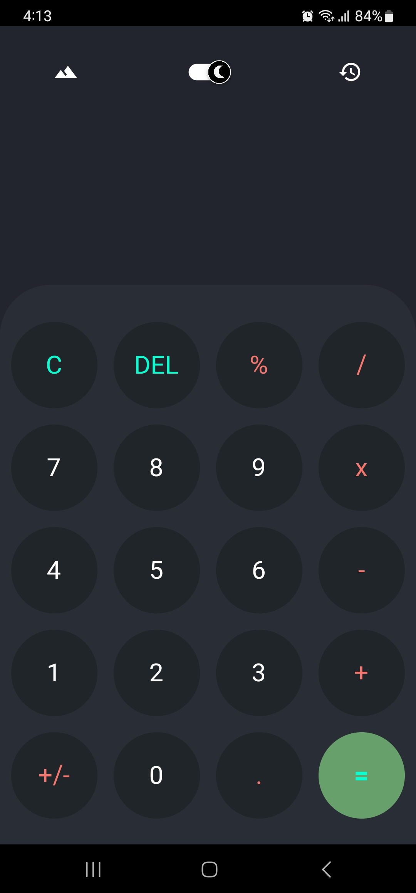
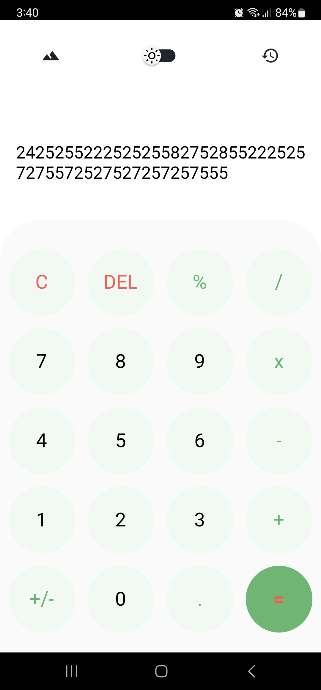
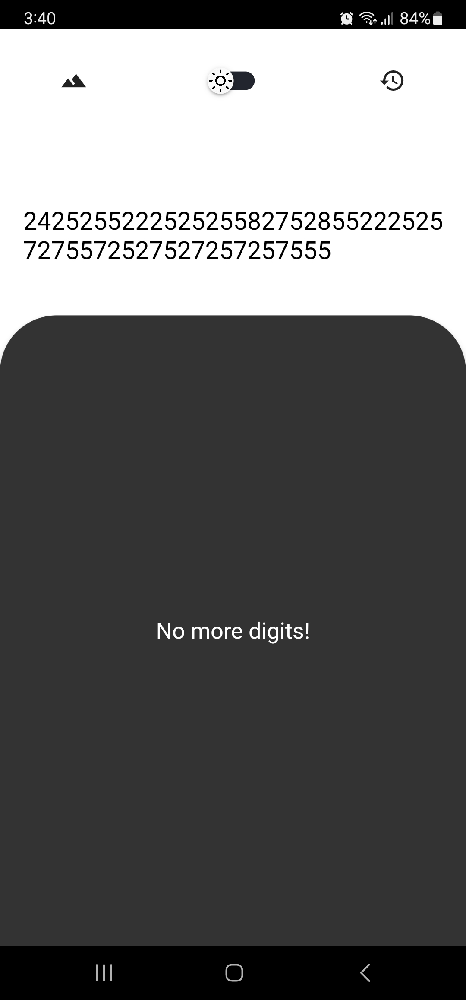
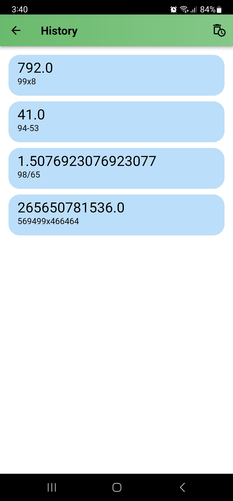
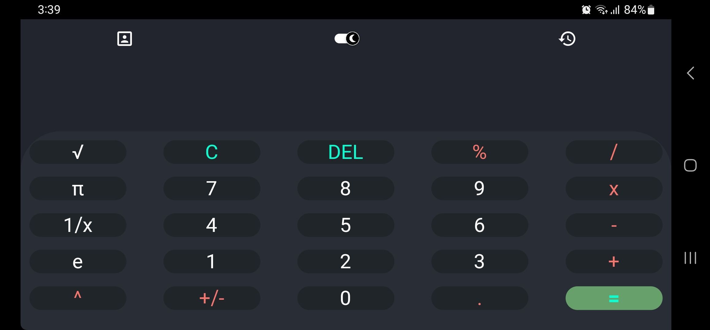

# ✔️🔥 Calculator-App

A calcuator app, created with dart and flutter framework with bloc statemanagement.

## Getting Started

Calculator app is designed to be user-friendly and intuitive, allowing users to quickly and easily perform calculations on their mobile device.

Star ⭐ the repo to support the project.

## Features

- Performing basic mathematical calculations such as addition, subtraction, multiplication, and division. 

- Includeing more advanced features such as scientific calculations.

- Adding numbers up to 52 digits.

- Supoort Responsivity.

- Theme mode (Light mode - Dark mode).

- Storing all the previous operations and delete them.

## Screenshots

  
   

  
   

  
   

## Questions?🤔

Hit me on

## Contributing

Pull requests are welcome.
